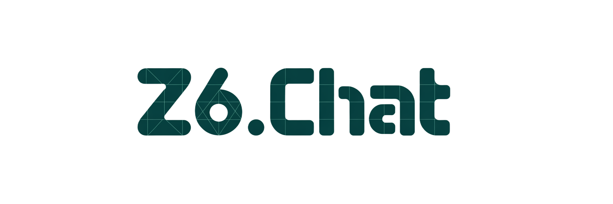

# Z6Chat - T3 Cloneathon Competition Entry



## 🏆 Competition Submission

**Z6Chat** is our entry for the T3Chat Cloneathon - a sophisticated AI chat interface with advanced features designed to showcase what's possible when combining modern web technologies with powerful AI capabilities.

## 🚀 Quick Start for Judges

### Option 1: Deploy Your Own Instance (Recommended)

1. **Fork this repository** to your GitHub account

2. **Deploy to Vercel** (Free):
   - Go to [vercel.com](https://vercel.com)
   - Click "New Project"
   - Import your forked repository
   - Add these environment variables:
     ```
     NEXT_PUBLIC_CONVEX_URL=https://perfect-fly-8.convex.cloud
     OPENROUTER_API_KEY=your-api-key-here
     ```
   - Click "Deploy"

3. **Get an OpenRouter API Key** (if needed):
   - Visit [openrouter.ai](https://openrouter.ai)
   - Sign up for a free account
   - Generate an API key
   - Add it to your Vercel environment variables

### Option 2: Run Locally

```bash
# Clone the repository
git clone https://github.com/john-savepoint/T3-Close-ne.git
cd T3-Close-ne

# Install dependencies
pnpm install

# Create .env.local file
cp .env.local.example .env.local

# Add your OpenRouter API key to .env.local
# OPENROUTER_API_KEY=your-api-key-here

# Start the development server
pnpm dev

# In another terminal, start Convex
pnpm dev:convex

# Open http://localhost:3000
```

## 🌟 Key Features

### Core Functionality
- ✅ **Multi-Model Chat**: Access 50+ AI models including GPT-4, Claude, Gemini, and Llama
- ✅ **Real-time Streaming**: Smooth, responsive chat experience
- ✅ **Chat Persistence**: All conversations saved with full history
- ✅ **File Attachments**: Upload images, PDFs, and documents
- ✅ **Model Switching**: Change AI models mid-conversation
- ✅ **Cost Tracking**: See token usage and costs per message

### Advanced Features
- 🎨 **Professional Dark Theme**: Beautiful mauve/purple aesthetic
- 📁 **Chat Management**: Archive, trash, and restore conversations
- 🔍 **Full-Text Search**: Find any conversation instantly
- 📎 **Smart File Handling**: Automatic file type detection and validation
- ⚡ **Edge Runtime**: Optimized for speed and performance
- 📱 **Mobile Responsive**: Works perfectly on all devices

### Tools & Utilities
- 📧 **Email Responder**: Draft professional email responses
- 📱 **Social Media Generator**: Create engaging posts for any platform
- 📝 **Summarizer**: Condense long texts into key points
- 📊 **Diagrammer**: Visualize processes and relationships

## 🎯 How to Test

1. **Start a Chat**: Click "New Chat" and type a message
2. **Try Different Models**: Use the model switcher (⌘K or Ctrl+K)
3. **Upload Files**: Drag and drop images or PDFs into the chat
4. **Explore Tools**: Click "New" → "Tools" to access AI-powered utilities
5. **Manage Chats**: Archive or delete chats from the sidebar

## 🛠️ Technology Stack

- **Frontend**: Next.js 15, React 19, TypeScript
- **Backend**: Convex (real-time database)
- **AI Integration**: OpenRouter API (50+ models)
- **Styling**: Tailwind CSS with custom design system
- **UI Components**: Radix UI primitives

## 📋 Environment Variables

```bash
# Required
NEXT_PUBLIC_CONVEX_URL=https://perfect-fly-8.convex.cloud
OPENROUTER_API_KEY=sk-or-v1-xxxxx

# Optional (for additional features)
OPENAI_API_KEY=sk-xxxxx              # For DALL-E image generation
UPSTASH_REDIS_REST_URL=xxxxx        # For resumable streams
UPSTASH_REDIS_REST_TOKEN=xxxxx      # For resumable streams
```

## 🎨 Design Philosophy

Z6Chat features a sophisticated dark theme with mauve/purple accents, creating a premium feel that sets it apart from typical chat interfaces. Every interaction is smooth and responsive, with careful attention to micro-animations and user feedback.

## 🚧 Known Limitations

- **Vercel Free Tier**: Some advanced features may hit rate limits
- **BYOK**: Judges need to provide their own OpenRouter API key

## 📝 Competition Notes

- Built in 48 hours for the T3Chat Cloneathon
- Focuses on advanced features beyond basic chat functionality
- Demonstrates mastery of modern web technologies
- Ready for production use with minimal configuration

## 🤝 Team

Built with passion by the Save Point team for the T3 Cloneathon competition.

---

**Thank you for reviewing Z6Chat! We hope you enjoy exploring its capabilities.**
